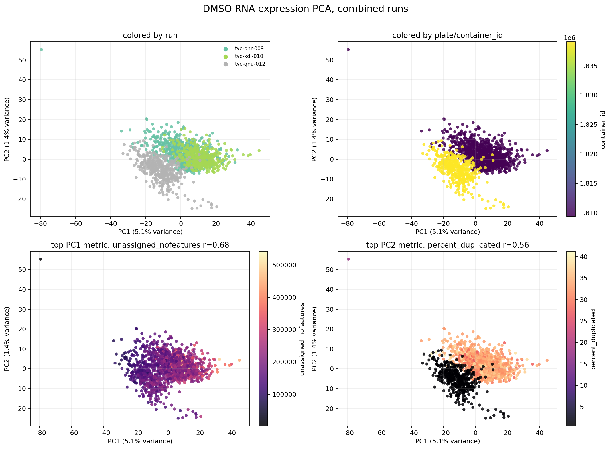
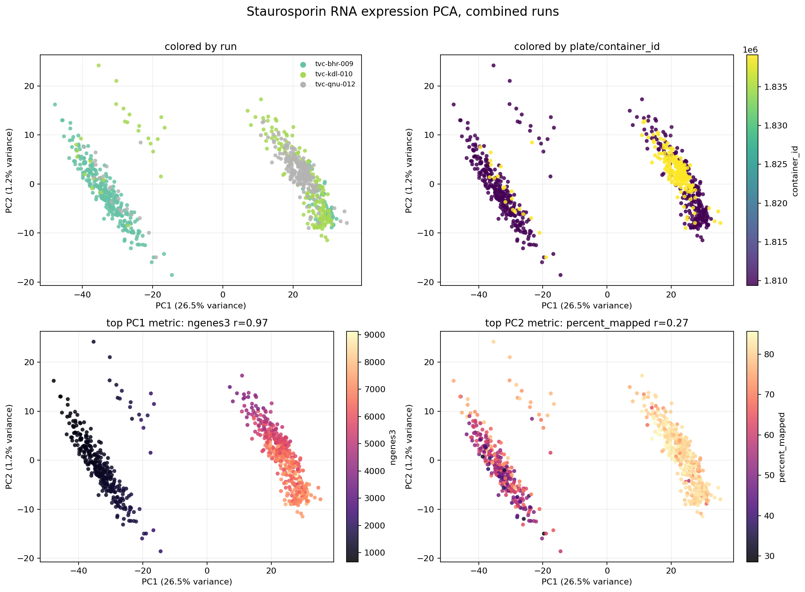
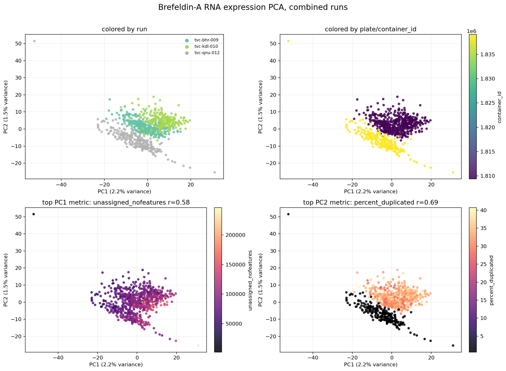
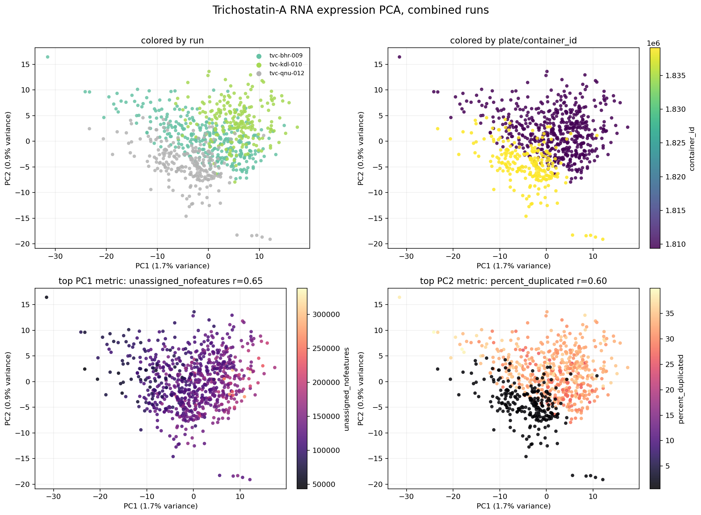
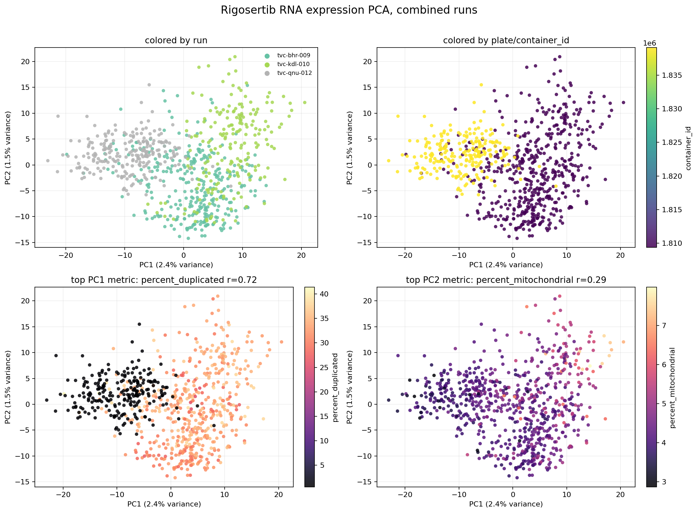
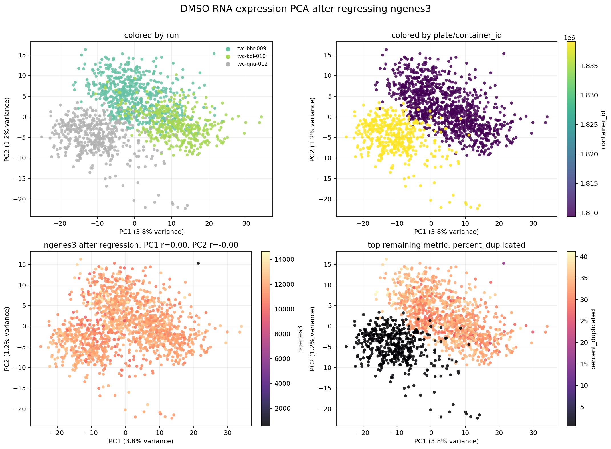
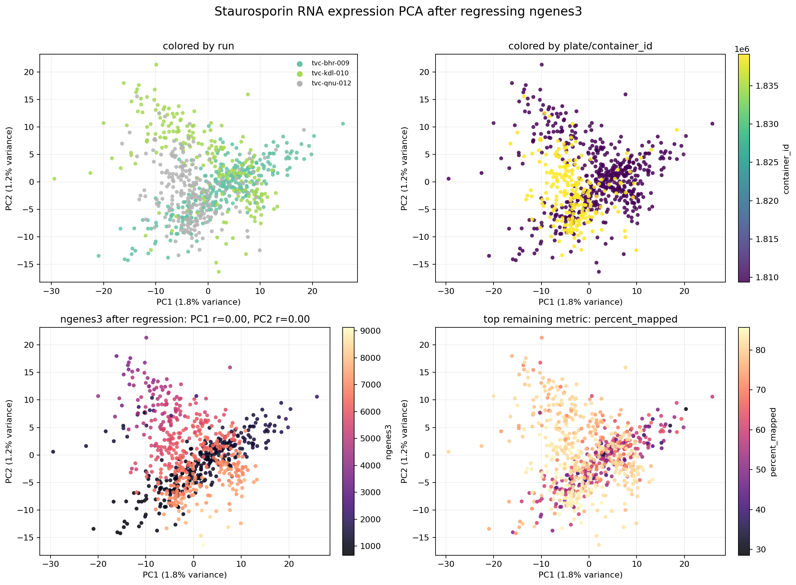
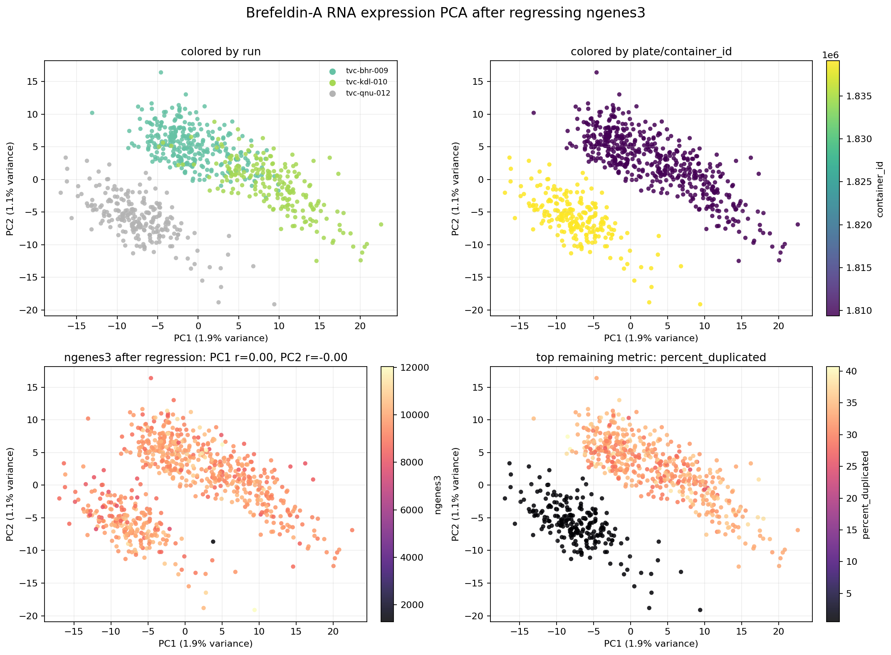
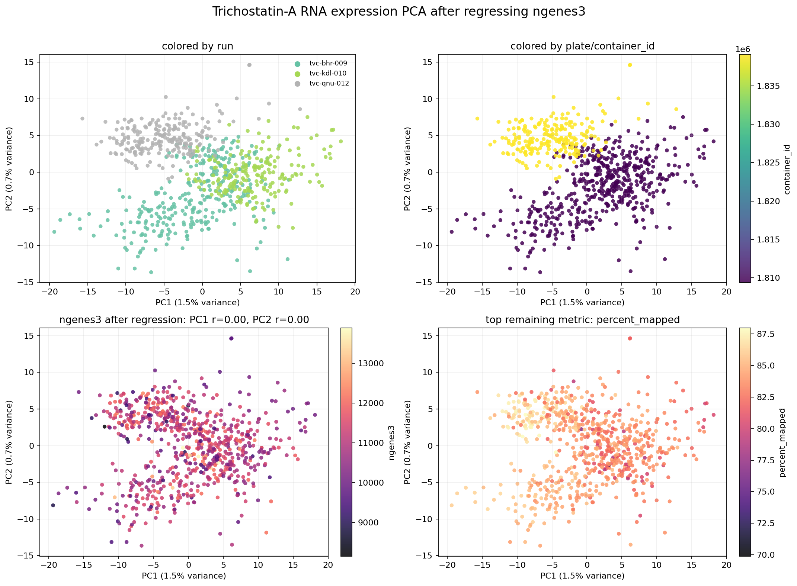
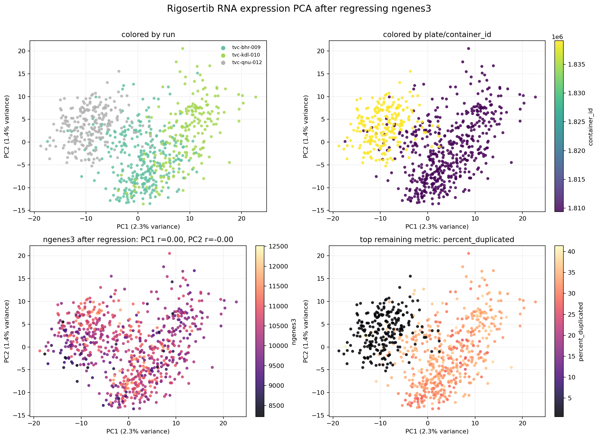

# Control-Drug PCA EDA

This note summarizes a quality-control PCA workflow for VCPI Drug-seq control
wells. The goal is to identify whether control expression profiles vary mostly
by biology or by technical factors such as plate, sequencing depth, mapping
quality, or library complexity.

## Inputs

The analysis used three downloaded VCPI jobs:

| Job | Metadata rows | Count samples | DMSO wells | Other control wells per drug |
| --- | ---: | ---: | ---: | ---: |
| `tvc-bhr-009` | 29,172 | 29,172 | 616 | 308 |
| `tvc-kdl-010` | 19,140 | 19,140 | 408 | 204 |
| `tvc-qnu-012` | 21,888 | 21,888 | 456 | 228 |

Duplicate check:

- No overlapping `sequenced_id` values were found across the three metadata files.
- Each count parquet matched its metadata sample IDs exactly.
- The shared compounds across chemistry files were the expected controls: DMSO,
  Staurosporin, Brefeldin-A, Trichostatin-A, and Rigosertib.

## Method

For each control compound, the workflow:

1. Selects wells where `is_control` is true and `user_compound_id` matches the
   control compound.
2. Reads only those sample columns from each wide count parquet.
3. Verifies that `gene_id` order matches across experiments.
4. Library-size normalizes counts to counts per million.
5. Applies `log1p` transform.
6. Keeps the top 3,000 variable expressed genes.
7. Runs PCA with singular value decomposition.
8. Correlates PC scores with continuous QC metrics.
9. Measures categorical effects such as `container_id` and `source_run` with
   eta-squared, the fraction of PC variance explained by group labels.

## Column Definitions

`container_id` is the physical plate identifier. In these datasets, each plate
appears to be a 384-well plate, with `row_id` from 1 to 16 and `column_id` from
1 to 24.

`job_plate` is a combined label of `job_id:container_id`. It is useful when
combining jobs, because plate IDs may only be meaningful within a job.

`ngenes3` is the number of genes detected with at least 3 UMIs in a well. UMI
means unique molecular identifier, a barcode used to count original RNA
molecules while reducing PCR duplicate inflation.

`percent_duplicated` is the fraction of reads that are duplicates. High values
can indicate lower library complexity.

`percent_mapped` is the fraction of sequencing reads that aligned to the
reference genome or transcriptome.

`percent_rrna_removed` tracks ribosomal RNA-related filtering. Ribosomal RNA is
very abundant but usually not the signal of interest in gene-expression
profiling.

`percent_mitochondrial` is the fraction of signal from mitochondrial genes. High
values can indicate stressed or damaged cells.

`unassigned_nofeatures` is the number of reads that mapped somewhere but did not
overlap an annotated gene or feature.

## Results

The strongest pattern across the combined control PCAs is technical structure:
plate and QC metrics explain substantial variation in the first PCs.

### PCA Figures











| Drug | PC1 variance | PC2 variance | Main PC1 drivers | Main PC2 drivers |
| --- | ---: | ---: | --- | --- |
| DMSO | 5.07% | 1.36% | `job_plate`, `unassigned_nofeatures`, `percent_duplicated`, `percent_mitochondrial`, `ngenes3` | `job_plate`, `percent_duplicated`, `ngenes3`, `percent_rrna_removed`, `percent_mapped` |
| Staurosporin | 26.52% | 1.20% | `job_plate`, `ngenes3`, `percent_rrna_removed`, unassigned read metrics | `job_plate`, `percent_mapped`, `percent_rrna_removed` |
| Brefeldin-A | 2.19% | 1.49% | `job_plate`, `unassigned_nofeatures`, `percent_mitochondrial`, `ngenes3` | `job_plate`, `percent_duplicated`, `ngenes3`, `n_mapped` |
| Trichostatin-A | 1.67% | 0.87% | `job_plate`, `unassigned_nofeatures`, `ngenes3`, `percent_mitochondrial` | `job_plate`, `percent_duplicated`, `ngenes3`, `n_mapped`, `total_umi_count` |
| Rigosertib | 2.40% | 1.45% | `job_plate`, `percent_duplicated`, `source_run`, `percent_mitochondrial` | `job_plate`, `percent_mitochondrial`, `percent_rrna_removed`, `unassigned_nofeatures` |

Staurosporin is the clearest warning case. Its PC1 explains 26.52% of variance,
with very strong associations to plate and gene-detection quality:

- `job_plate` eta-squared: 0.985
- `ngenes3` Pearson correlation: 0.973
- `percent_rrna_removed` Pearson correlation: -0.916

## Interpretation

Control wells should be relatively consistent within a compound. When PCA
separates controls by plate or sequencing QC metrics, the variation is likely
technical rather than biological. The large `container_id` and `job_plate`
effects mean wells from the same plate are more similar to each other than to
the same control on other plates.

This matters for drug-response modeling. If expression responses are computed
without plate-aware correction, the model can learn plate artifacts as if they
were compound effects.

## PCA After Regressing `ngenes3`

To test whether gene-detection depth was driving the control PCAs, we repeated
the PCA after regressing `ngenes3` out of every gene's log-normalized expression.
This is a diagnostic correction, not a final recommended response-generation
method by itself.











| Drug | PC1 variance after correction | PC2 variance after correction | PC1 correlation with `ngenes3` | Top remaining PC1 metric |
| --- | ---: | ---: | ---: | --- |
| DMSO | 3.80% | 1.18% | 0.00 | `percent_duplicated` |
| Staurosporin | 1.84% | 1.23% | 0.00 | `percent_mapped` |
| Brefeldin-A | 1.95% | 1.13% | 0.00 | `percent_duplicated` |
| Trichostatin-A | 1.47% | 0.74% | 0.00 | `percent_mapped` |
| Rigosertib | 2.30% | 1.41% | 0.00 | `percent_duplicated` |

The largest change was Staurosporin. Before correction, Staurosporin PC1
explained 26.52% of variance and correlated with `ngenes3` at 0.973. After
regressing `ngenes3`, PC1 dropped to 1.84% and its `ngenes3` correlation was
approximately zero. This strongly suggests that the original Staurosporin PC1
was dominated by gene-detection depth rather than a biological control-drug
response.

After removing `ngenes3`, other technical metrics still explain residual
structure, especially `percent_duplicated`, `percent_mapped`, and
`percent_rrna_removed`. This means `ngenes3` correction helps, but does not
remove all technical variation.

Recommended preprocessing before modeling:

1. Filter obvious low-quality wells using metrics such as `total_umi_count`,
   `ngenes3`, `percent_mapped`, `percent_mitochondrial`, and PCA outliers.
2. Normalize counts by library size and log-transform.
3. Estimate plate-level DMSO baselines per gene.
4. Apply DMSO-anchored mean-shift correction, or compute each perturbation
   response relative to same-plate DMSO controls.
5. Keep validation splits compound-held-out, and preferably scaffold-held-out,
   so validation mimics unseen-compound evaluation.

## Reproducing

This example uses `pandas`, `numpy`, `pyarrow`, and `matplotlib`.

Run:

```bash
python examples/control_drug_pca.py \
  --experiment tvc-bhr-009:/path/to/metadata-tvc-bhr-009.csv:/path/to/vcpi_tvc-bhr-009_counts.parquet \
  --experiment tvc-kdl-010:/path/to/metadata-tvc-kdl-010.csv:/path/to/vcpi_tvc-kdl-010_counts.parquet \
  --experiment tvc-qnu-012:/path/to/metadata-tvc-qnu-012.csv:/path/to/vcpi_tvc-qnu-012_counts.parquet \
  --out-dir eda_outputs/full_control_drug_pcas
```

The script writes one plot per control compound plus:

- `*_full_pca_scores.csv`
- `*_full_pc_metric_associations.csv`
- `all_full_control_pc_metric_associations.csv`
- `top_full_pc_metric_associations.csv`
- `full_pca_sample_counts.csv`
