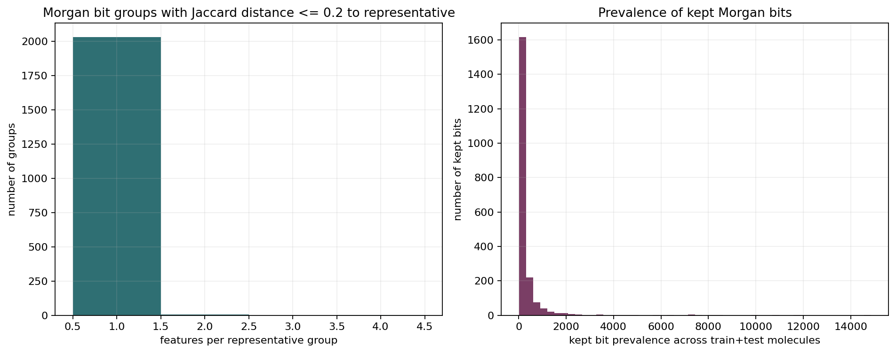

# Morgan Fingerprint Jaccard Pruning

This analysis starts from 2048-bit Morgan fingerprints for both training and
test compounds, rather than Artur's 512-bit ridge-model setup.

## Inputs

Training compounds:

- `compounds-tvc-bhr-009-2026-05-30.csv`
- `compounds-tvc-kdl-010-2026-05-30.csv`
- `compounds-tvc-qnu-012-2026-05-30.csv`

Test compounds:

- `src/vcpi_prediction_contest/data_files/test_compounds.csv`

Controls were excluded from the train side:

- DMSO
- Staurosporin
- Brefeldin-A
- Trichostatin-A
- Rigosertib

## Method

1. Parse each SMILES string with RDKit.
2. Compute Morgan fingerprints with radius 2 and 2048 bits.
3. Build a binary matrix:

   ```text
   rows = train + test compounds
   columns = Morgan bits
   values = bit present / absent
   ```

4. Compute Jaccard distance between feature columns.
5. Greedily keep one representative bit for groups where other unassigned bits
   are within Jaccard distance `<= 0.2` of the representative.

The grouping is representative-based, not connected-components based. This
matters because connected components can create long transitive chains where
feature A is close to B and B is close to C, even if A is not close to C.

## Results

| Metric | Value |
| --- | ---: |
| Valid train compounds | 14,026 |
| Valid test compounds | 1,064 |
| Invalid SMILES | 0 |
| Starting Morgan bits | 2,048 |
| Nonzero Morgan bits | 2,048 |
| Kept bits | 2,038 |
| Removed redundant bits | 10 |
| Largest group size | 4 |
| Groups with more than one feature | 8 |



The pruning threshold is strict: Jaccard distance `<= 0.2` means feature-column
occurrence patterns must be very similar across the 15,090 train+test molecules.
As a result, only 10 of the 2,048 Morgan bits were removed.

## Outputs

Generated files:

- `figures/morgan_jaccard_pruning/morgan2048_jaccard_leq0p2_summary.csv`
- `figures/morgan_jaccard_pruning/morgan2048_jaccard_leq0p2_kept_bits.csv`
- `figures/morgan_jaccard_pruning/morgan2048_jaccard_leq0p2_feature_groups.csv`
- `figures/morgan_jaccard_pruning/morgan2048_jaccard_leq0p2_reduced_features.parquet`
- `figures/morgan_jaccard_pruning/morgan_train_test_compound_metadata.csv`

The reduced feature parquet contains:

```text
source
compound_key
smiles
morgan_<kept_bit>...
```

where `source` is either `train` or `test`.
