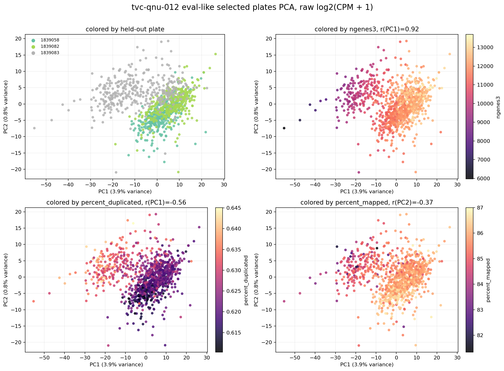
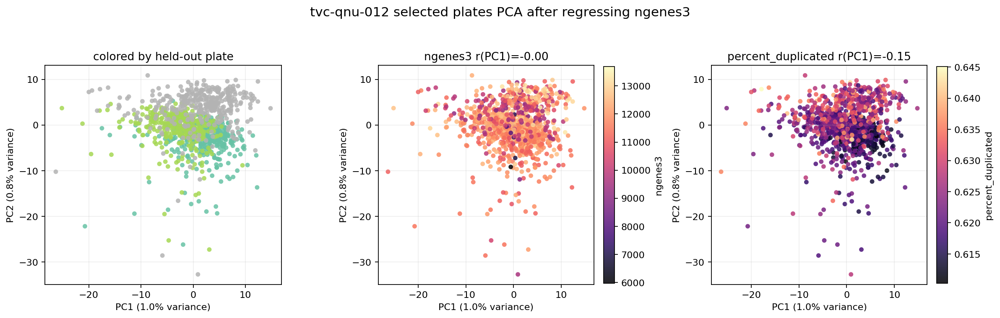

# QNU Eval-Split PCA

This PCA is meant to visualize the expression space behind Artur's
`tvc-qnu-012` plate-holdout eval branch.

## What I Think Was Requested

Artur's eval branch validates on three selected `tvc-qnu-012` plates:

- `1839083`
- `1839058`
- `1839082`

The eval README says those plates were selected because their active compounds
are chemically similar to the final test compounds by plate-level Morgan
Tanimoto similarity.

The natural PCA request is therefore:

```text
Take the expression profiles for the eval-like held-out qnu plates
and show whether the major axes are biology, plate/batch, or QC.
```

## Local Caveat

The full eval branch expects generated files such as `train_metadata.parquet`,
`train_counts.parquet`, `weights.parquet`, and an active-compound split. Those
files were not present in this local checkout.

So this PCA uses the available full local `tvc-qnu-012` metadata/count files and
selects:

- the same three eval plates,
- non-control wells,
- target dose `10000 nM`,
- raw `log2(CPM + 1)` expression, matching the eval target scale.

This produced:

```text
1,080 selected wells
3 plates
540 unique compounds
360 wells per selected plate
```

Because the DESeq2 active-compound labels were not locally available, this plot
should be read as an **eval-like selected-plate PCA**, not a perfect reproduction
of the active-only eval split.

## PCA Before `ngenes3` Correction



Results:

```text
PC1 variance: 3.91%
PC2 variance: 0.85%
PC3 variance: 0.75%
```

Top PC1 associations:

| Metric | Association |
| --- | ---: |
| `ngenes3` | r = 0.921 |
| `total_umi_count` | r = 0.823 |
| `percent_mapped` | r = 0.566 |
| `percent_duplicated` | r = -0.559 |
| `container_id` | eta-squared = 0.362 |

Interpretation:

The largest expression axis in these selected qnu eval plates is mostly gene
detection/library-depth structure. `ngenes3` and `total_umi_count` dominate PC1,
while plate identity also explains a meaningful part of PC1. This suggests that
even in the eval-like split, expression variation contains technical structure
that is not purely compound biology.

## PCA After Regressing `ngenes3`



After regressing `ngenes3` out of each gene's log-normalized expression:

```text
PC1 variance: 1.00%
PC2 variance: 0.83%
PC3 variance: 0.74%
```

Interpretation:

Removing `ngenes3` collapses the leading axis from 3.91% to 1.00%, confirming
that PC1 was largely a gene-detection-depth axis. Residual structure remains,
especially through other QC variables such as `percent_duplicated`,
`percent_mapped`, and `percent_rrna_removed`.

## Modeling Implication

This supports the same conclusion as the control-drug PCA:

```text
Use plate-aware and QC-aware preprocessing before training or interpreting
compound-response models.
```

For Artur's eval specifically, the PCA suggests that held-out qnu plate
performance may be affected by technical variation in the truth expression
vectors, not only by chemical generalization difficulty.
