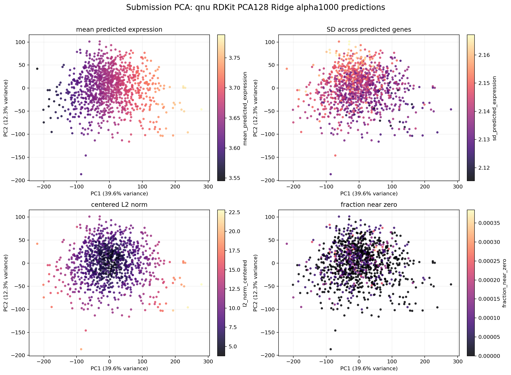
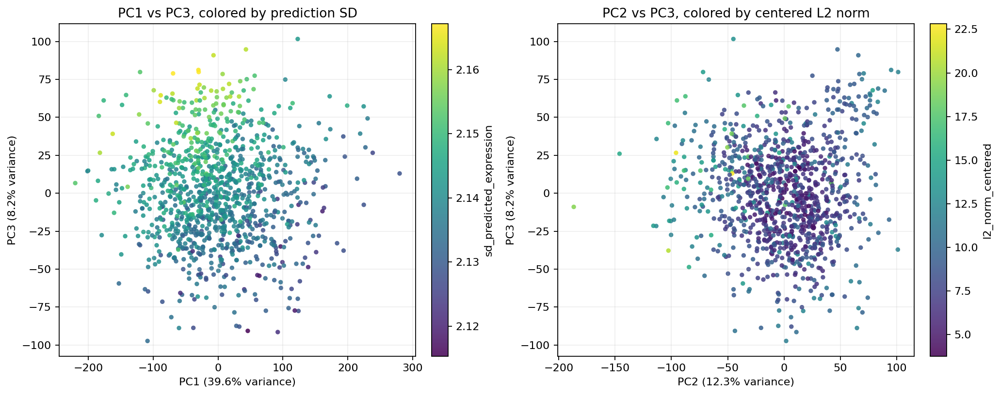
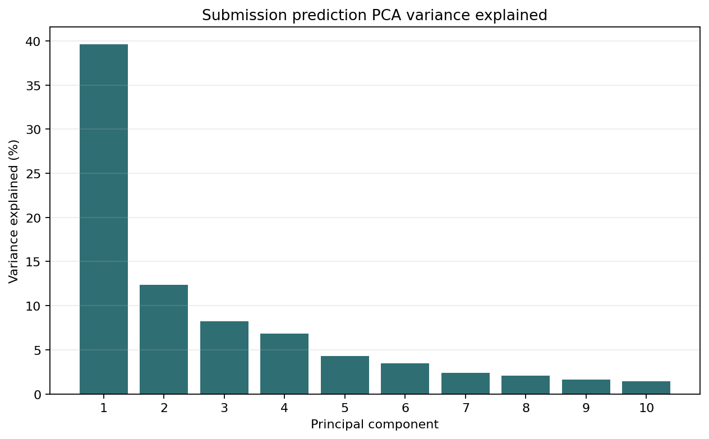

# Submission Prediction PCA

This PCA analyzes Artur's model submission file:

```text
submission_qnu_rdkit_pca128_ridge_alpha1000.parquet
```

The file is in long format:

```text
compound | gene_id | predicted_expression
```

It contains:

```text
1,064 compounds
12,995 genes
13,826,680 compound-gene predictions
```

## Method

The submission was pivoted into a compound-by-gene matrix:

```text
rows = compounds
columns = genes
values = predicted_expression
```

PCA was run on the predicted expression signatures after standardizing genes.
This means the PCA summarizes how the **model's predicted transcriptomic
profiles** vary across compounds.

Because this submission file does not include metadata, dose, plate, truth, or
chemistry columns, the PCA is colored by prediction-level diagnostics:

- mean predicted expression per compound,
- standard deviation across predicted genes,
- centered L2 norm,
- fraction of near-zero predicted values.

## Results







Variance explained:

| PC | Variance explained |
| --- | ---: |
| PC1 | 39.57% |
| PC2 | 12.33% |
| PC3 | 8.20% |
| PC4 | 6.84% |
| PC5 | 4.31% |

Top diagnostic associations:

| PC | Top associated diagnostic | Correlation |
| --- | --- | ---: |
| PC1 | mean predicted expression | 0.988 |
| PC2 | SD across predicted genes | 0.455 |
| PC3 | SD across predicted genes | 0.668 |
| PC4 | fraction near zero | -0.337 |

## Interpretation

The dominant axis of the submission PCA is not a batch effect, because this file
contains only model predictions and no plate/run metadata. PC1 is almost
perfectly correlated with each compound's mean predicted expression:

```text
PC1 vs mean predicted expression: r = 0.988
```

So PC1 mostly separates compounds for which the model predicts globally higher
or lower expression values across genes.

PC2 and PC3 are more related to the spread of each compound's predicted gene
profile:

```text
PC2 vs prediction SD: r = 0.455
PC3 vs prediction SD: r = 0.668
```

This means those axes separate flatter predictions from predictions with more
gene-to-gene variation.

## Modeling Meaning

This PCA is a model-output diagnostic. It tells us about the structure of the
predictions produced by the RDKit + target-PCA ridge model.

Main takeaways:

1. A large fraction of prediction variation is a global expression-level shift.
2. Secondary axes capture how strong or variable the predicted signatures are.
3. To interpret biological programs, this should be joined with compound
   chemistry, target annotations, or true-expression/evaluation metadata.
4. To assess whether the model is reproducing batch effects, this prediction PCA
   should be compared against truth PCA or residual PCA on the same compounds.

Useful output files:

- `figures/submission_pca/submission_qnu_rdkit_pca128_ridge_alpha1000_pca_scores.csv`
- `figures/submission_pca/submission_qnu_rdkit_pca128_ridge_alpha1000_pca_associations.csv`
