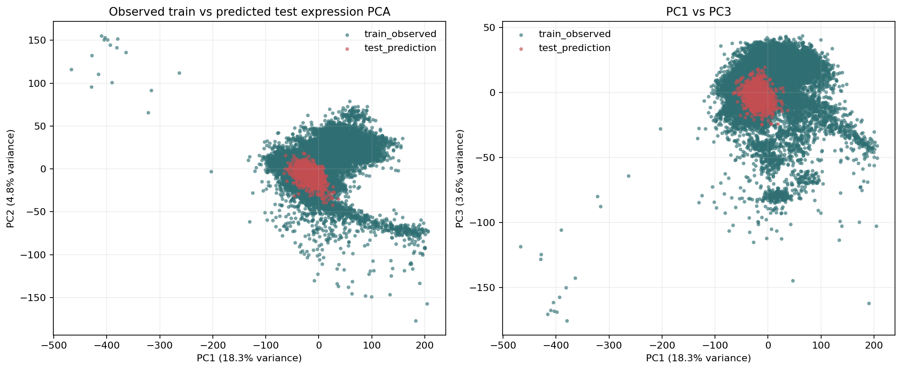
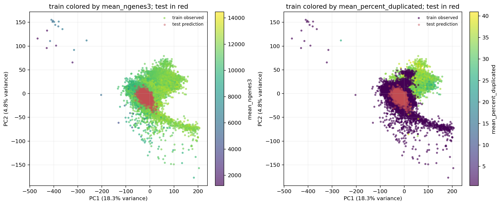
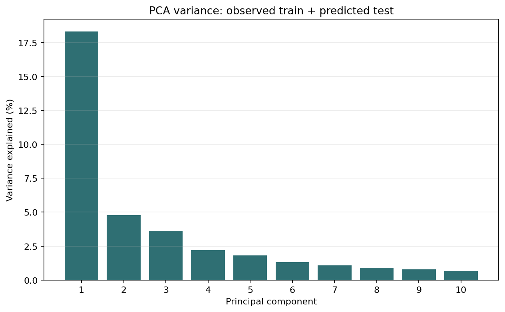

# Train Observed vs Test Prediction Expression PCA

This PCA compares:

- observed expression signatures for training compounds, and
- predicted expression signatures for test compounds from
  `submission_qnu_rdkit_pca128_ridge_alpha1000.parquet`.

## What Was Done

The attached submission file contains predicted expression, not measured test
counts:

```text
compound | gene_id | predicted_expression
```

So the comparison matrix was built as:

```text
train compounds = observed expression from count parquets
test compounds = model-predicted expression from the submission parquet
```

Training compounds were selected from the three local VCPI jobs:

- `tvc-bhr-009`
- `tvc-kdl-010`
- `tvc-qnu-012`

Controls were excluded:

- DMSO
- Staurosporin
- Brefeldin-A
- Trichostatin-A
- Rigosertib

Only target-dose non-control wells were used:

```text
compound_concentration = 10000 nM
compound_concentration_unit = nM
```

For training compounds, raw counts were normalized to `log2(CPM + 1)` and
technical replicates were averaged to one expression vector per
`user_compound_id`. For test compounds, the submission predictions were pivoted
to one vector per compound.

PCA was then run on the combined compound-by-gene matrix using the 12,995 genes
present in the submission file.

## Dataset Size

```text
observed train compounds: 14,026
predicted test compounds: 1,064
shared genes: 12,995
train/test compound ID overlap: 0
```

## PCA







Variance explained:

| PC | Variance explained |
| --- | ---: |
| PC1 | 18.32% |
| PC2 | 4.78% |
| PC3 | 3.65% |
| PC4 | 2.19% |
| PC5 | 1.81% |

The PC1/PC2 centroid distance between observed train compounds and predicted
test compounds is:

```text
21.56 PCA units
```

## Interpretation

The predicted test signatures form a visibly shifted cloud relative to the
observed train signatures. This does not necessarily mean the model is wrong,
because the two groups are not the same data type:

```text
train = observed expression
test = model prediction
```

But it is an important diagnostic. It means the submission predictions occupy a
somewhat different expression space than the observed training compounds.

Possible explanations:

1. The model smooths predictions toward a lower-dimensional target-PCA manifold.
2. The test compounds are chemically different from many training compounds.
3. Predicted expression has less experimental noise than observed expression.
4. The model may have a global expression-level shift relative to observed data.
5. Remaining train batch/QC effects may broaden the observed train cloud.

## Recommended Follow-Up

To make the interpretation sharper, compare:

1. observed validation compounds vs predicted validation compounds on Artur's
   held-out qnu plates,
2. residuals, meaning `truth - prediction`, for validation compounds,
3. the same PCA after applying the exact official gene weights and active-only
   DESeq2 split,
4. chemistry-colored PCA, using Morgan/descriptor similarity to see whether the
   test prediction cloud corresponds to chemical neighborhoods.

Useful output files:

- `figures/train_test_expression_pca/train_observed_vs_test_prediction_pca_scores.csv`
- `figures/train_test_expression_pca/train_observed_vs_test_prediction_pca_summary.csv`
